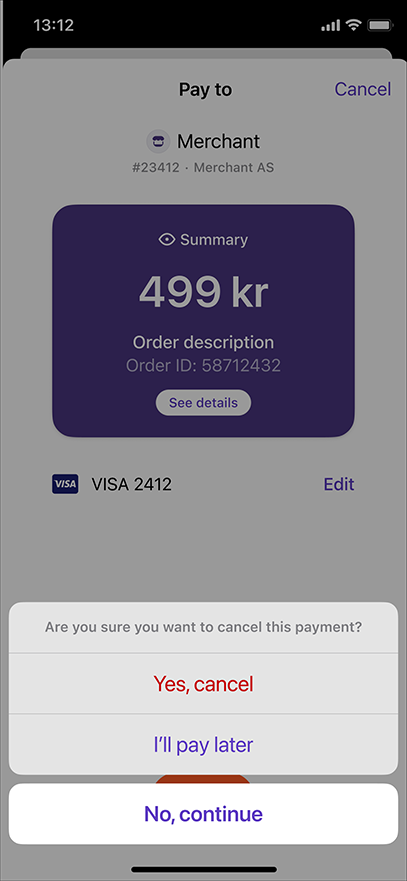
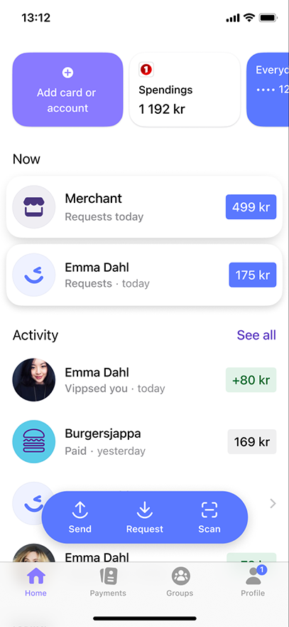

<!-- START_METADATA
---
title: Extended expiration payments
---
END_METADATA -->

# Extended expiration for payments to merchants

<!-- START_COMMENT -->

ℹ️ Please use the new documentation:
[Vipps Technical Documentation](https://vippsas.github.io/vipps-developer-docs/).

<!-- END_COMMENT -->

💥 Work in progress 💥


The typical expiration time for payments is
payment is
[10 minutes](https://vippsas.github.io/vipps-developer-docs/docs/vipps-developers/common-topics/timeouts).
But, in some cases, this is not enough time for a customer to complete the payment.

For instance:

* Paying at a doctor's office, where the payment request may arrive as the patient
  is leaving the office and doesn't notice it.
* Paying at a toll road where the driver cannot stop to complete the payment.

You can extend this expiration time for payments through the
[ePayment API](https://vippsas.github.io/vipps-developer-docs/docs/APIs/epayment-api).


**Please note:** Sale units (i.e., Merchant Serial Numbers (MSNs)) must be especially approved to use this feature.
Vipps wants the user experience, including the standard timeout, to be as
consistent as possible, so `expiresAt` should only be used in special cases.
Please contact your key account manager (KAM) to get access to this feature.

Extending the payment expiration time is done by setting the `expiresAt` parameter in the
[`POST:/epayment/v1/payments`](https://vippsas.github.io/vipps-developer-docs/api/epayment#tag/CreatePayments)
request.
The `expiresAt` must be between 10 minutes and 28 days (40320 minutes) in the future.

Here is an example of a valid request body:

```json
{
   "amount":{
      "currency":"NOK",
      "value":49900
   },
   "customer":{
      "phoneNumber":4791234567
   },
   "paymentMethod":{
      "type":"wallet"
   },
   "reference":"acme-shop-123-order123abc",
   "returnUrl":"https://example.com/redirect?orderId=1512202",
   "userFlow":"PUSH_MESSAGE",
   "expiresAt":"2023-02-15T00:00:00Z"
}
```

This will send a push message to the customer's Vipps app on their mobile phone.

If the above is attempted for a sale unit that is not authorized, it will result in
an error similar to this:

```json
{
    "type": "",
    "title": "Long living Ecom not allowed",
    "status": 400,
    "detail": "Merchant serial number 123456 is not allowed to perform long living Ecom transactions",
    "instance": "/v1/payments/",
    "traceId": "00-631d10d7ee147e46941a0725ed2dcd6a-54bda84425e20140-01"
}
```

You can design your system so that, if the customer's phone number is unknown, it will
send the request again with the `userFlow` set to `"QR"`.
This will return the QR code for a payment with the expiration time that you have specified.

The customer either clicks on the notification or scans the QR code to complete the payment flow in the Vipps app.


The customer can soft dismiss this payment by clicking `Cancel` -> `I'll pay later`.
This option will only be shown to payments that have `expiresAt` property set,
as shown below:



Soft-dismissed payments will be available in the Vipps app until expiry.
Vipps will remind the user when the payment is about to expire. For example:


