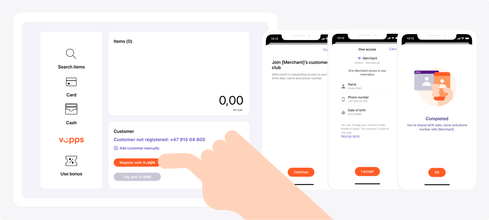

<!-- START_METADATA
---
title: Loyalty at POS
sidebar_position: 1
pagination_next: null
pagination_prev: null
---
END_METADATA -->

# Vipps Loyalty at the Point Of Sale

<!-- START_COMMENT -->

## Table of Contents

* [How it works](#how-it-works)
* [Step 1: Scan the QR code](#step-1-scan-the-qr-code)
* [Step 2: Check membership](#step-2-check-membership)
* [Step 3: Request membership (optional)](#step-3-request-membership-optional)
* [Step 4: Send a payment request](#step-4-send-a-payment-request)

<!-- END_COMMENT -->

## How it works

_Vipps Loyalty at Point Of Sale (POS)_ is a solution that combines multiple Vipps products and makes a great product-market fit for retail stores that want to combine loyalty with payments. It's a great way to improve the payment experience for customers and simplify the process of adding customers to the merchant loyalty club.

The solution is a combination of the personal QR codes in the Vipps app,
the
[Vipps Login API](https://vippsas.github.io/vipps-developer-docs/docs/APIs/login-api),
the
[Vipps eCom API](https://vippsas.github.io/vipps-developer-docs/docs/APIs/ecom-api),
and the
[Vipps Check-in API](https://vippsas.github.io/vipps-developer-docs/docs/APIs/check-in-api).

The following describes the _Loyalty at the POS_ process at a high-level. For a detailed step-by-step guide for how to implement _Loyalty at the POS_, see the [Quick Start](quick-start.md) guide.

## Step 1: Scan the QR code

The flow begins with the customer presenting their QR code to the merchant. This can happen two ways:

* Customer-facing scanner. The store will have a permanent customer-facing scanner and customers can scan their QR code at any time.
* The QR code is scanned by the cashier using a wired scanner. This could happen while the cashier is scanning wares or right before the payment.

When the Vipps QR code is scanned, you will get the customer's mobile number. Now, proceed to step 2 and check their membership status.

## Step 2: Check membership

Check the customer's membership status by using the mobile number you received in the last step.

Automatically trigger a Vipps Check-In to inform the customer whether or not they are a member of your loyalty program. This will help them through the payment process.

If the customer is a not member, proceed to step 3 where you can enroll them by using Vipps Login.

If they are already a member, skip to step 4.

## Step 3: Request membership (optional)

If the customer is not a member of the loyalty program, you can request to enroll them by using Vipps Login.

You already have their mobile number, so just provide a button in your user interface to allow the cashier to initiate the login.

Pressing the button will trigger a
[Vipps Login flow](https://vippsas.github.io/vipps-developer-docs/docs/APIs/login-api/vipps-login-api#vipps-login-from-phone-number)
to gather consent from the customer.
When this login flow is completed, the customer will be enrolled in the loyalty program.

## Step 4: Send a payment request

After membership status has been determined and all wares have been scanned, send a payment request to the customer.

You already have the mobile number, so just provide a button in your user interface to allow the cashier to send the payment request. A notification will appear on the customer's Vipps app.

Once they authorize the, the POS will be updated with the status of the payment. Done!

