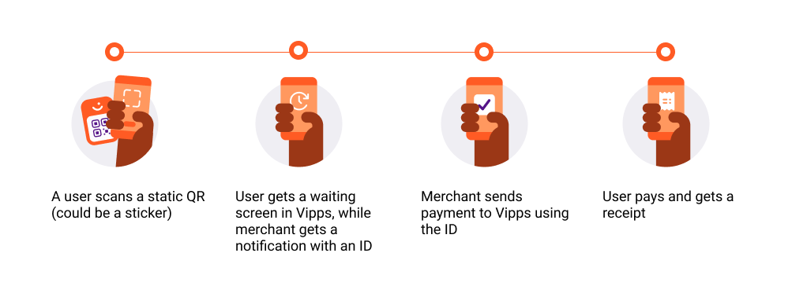

<!-- START_METADATA
---
title: Static QR at Point of Sale
sidebar_label: Static QR at Point of Sale
sidebar_position: 20
pagination_next: null
pagination_prev: null
---
END_METADATA -->

# Static QR at Point of Sale

## How it works

_Static QR at point of sale (POS)_ is a solution where a user tells that they want to pay by scanning a QR (could be on a sticker), followed by the merchant sending a payment to that user.

The solution is a combination of the
[Merchant Callback QRs](https://developer.vippsmobilepay.com/docs/APIs/qr-api),
and the
[Vipps ePayment API](https://developer.vippsmobilepay.com/docs/APIs/epayment-api).

The following describes the _Static QR at point of sale_ process at a high-level.

## Step 1: The user scan the QR

The user scans the static merchant callback QR. The QR could for example be shown on a screen, or be printed out and placed on a cash register, a portable pos or a vending machine

## Step 2: Merchant receives an ID

When the user scans the QR, the merchant will receive a notification that the QR has been scanned. Meanwhile, the Vipps/Mobilepay app will show a waiting screen to the user. Thus, the user understands that the scan was successful.

## Step 3: Merchant sends payment

When the merchant is ready to get paid, the merchant uses the ID received in previous step to send the payment to the user through the ePayments api.

## Step 4: The user pays and get a receipt in the app

Once the payment is sent by the merchant, the user will be shown the payment screen. If the user still has their app open, the payment will open automatically.
