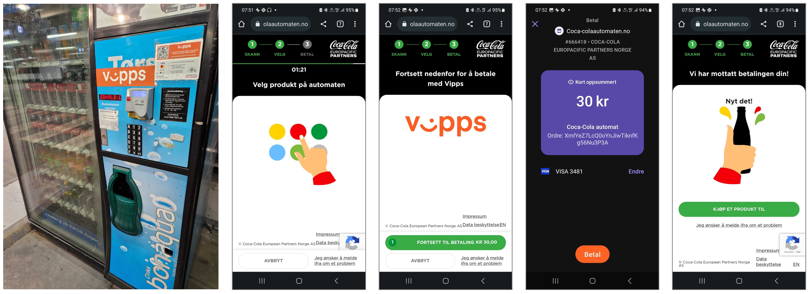
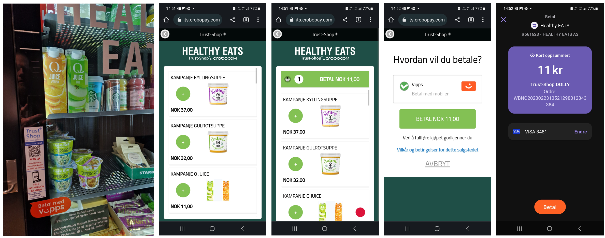

<!-- START_METADATA
---
title: Vending machines
sidebar_position: 80
pagination_next: null
pagination_prev: null
---
END_METADATA -->

# Vending machines

<!-- START_COMMENT -->

ℹ️ Please use the new documentation:
[Vipps Technical Documentation](https://vippsas.github.io/vipps-developer-docs/).

<!-- END_COMMENT -->

💥 Improvements coming soon. 💥

Vipps can make it easier for your customers to pay for products in vending machines.
The following are the most common scenarios.

## Scenario 1 - One-time payment QR direct to payment in Vipps app

A [Vipps QR code](https://vippsas.github.io/vipps-developer-docs/docs/APIs/qr-api/vipps-qr-one-time-payment-api-howitworks) is presented on the vending machine.

When the customer scans the QR code, they go directly to the Vipps payment screen on their phone, where they can approve the payment.

The QR code is a dynamic representation of the payment url, and user need to scan the QR code within 5 minutes.  

### When to use

* The One-Time payment QR code is preferred flow when it possible to show a QR code on the vending machine.

## Scenario 2 - QR direct to payment in Vipps app

A [Vipps QR code](https://vippsas.github.io/vipps-developer-docs/docs/APIs/qr-api/vipps-qr-api#merchant-redirect-qr-codes) is posted on the vending machine.

When the customer scans the QR code, they go directly to the Vipps payment screen on their phone, where they can approve the payment.

The payment amount should be the max amount of the vending machine products. After reservation, the amount of the selected product must be captured, and the remaining amount must be released. 

### When to use

* The merchant redirect QR code can be used when it is not possible to present the dynamic one-time payment QR described in scenario 1. 

## Scenario 3 - QR to a merchant site for payment options

A merchant-generated QR code is posted on the vending machine.

When the customer scans the QR code, they are taken to the merchant's landing page, which is waiting for the product to be selected on the vending machine.
The price is presented and the user pays for the product in their Vipps app.

## Scenario 4 - QR to a merchant site where products are selected

A merchant-generated QR code is posted on the vending machine.

When the customer scans the QR code,
they are taken to the merchant's landing page, where products can selected.
The price is presented and the user pays for the product in their Vipps app.

